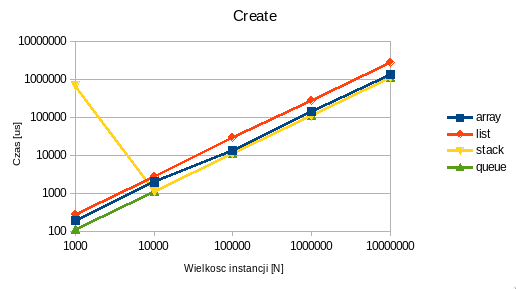
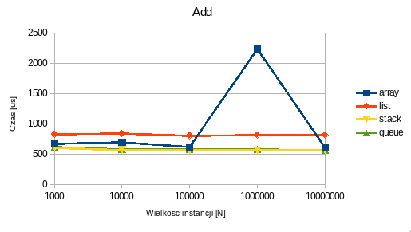
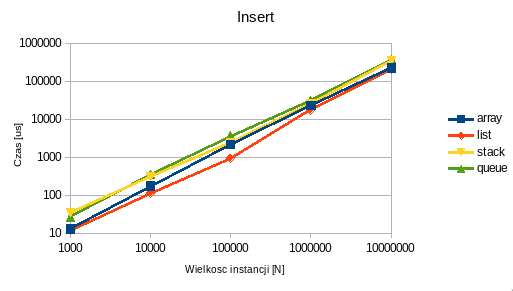
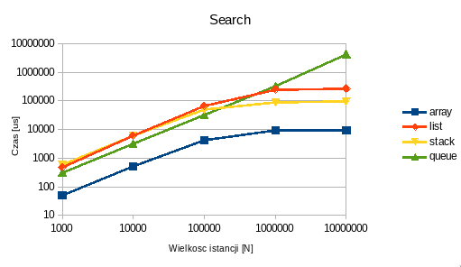
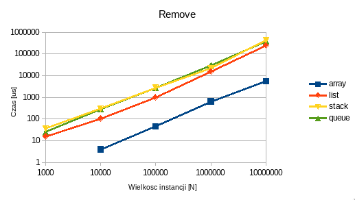

# Raport z zadania 1

## Metodyka testowa

Potrzebne dane były generowane na miejscu za pomocą `std::mt19937` zaseedowanego stałą wartością, aby zapewnić
niezmienność danych pomiędzy uruchomieniami.

Platforma testowa:

-   CPU: Ryzen 5 3600 3.6GHz
-   OS: Linux 5.11.6-1-MANJARO
-   libc: 2.33
-   g++: 10.2.0
-   Opcje kompilatora: `g++ src/main.cpp -Wall -Wextra -O`

## Potencjalne źródła błędów

### Implementacja malloc w libc

Funkcja `malloc` nie rezerwuje od razu całej pamięci o jaką ją poprosimy, tylko aby zaoszczędzić pamięć rezerwuje
kolejne bloki w momencie gdy chcemy użyć pamięci zwróconej przez `malloc`, np. wpisując do niej wartość. Skutkuje to
tym, że podczas wypełniania tablicy, dla jej dużych rozmiarów, mogą być wykonywane kolejne alokacje, zwiększając w ten
sposób czas wykonania.

### Implementacja memcpy

W konstruktorze kopiującym m.in. wektora używana jest funkcja `memcpy` aby zminimalizować czas kopiowania elementów.
Analiza pamięci fizycznej wykazała że kopia wektora o wielkości 1GiB nie zużywa pamięci. Możliwe że mamy do czynienia z
mechanizmem copy-on-write.

### Dynamic dispatch

Ponieważ używamy polimorfizmu aby nie pisać każdego przypadku testowego osobno dla każdej struktury danych, wywołanie
metody związanej z daną operacją wykorzystuje Vtable i wymagają wykonania skoku. Może to zwiększać czas wywołania dla
każdej iteracji o stałą wartość.

Możliwe rozwiązanie: wrzucić kod benchmarkujący do klasy, żeby wykonać dynamic dispatch tylko raz (przy wywołaniu metody
benchmark) a następnie zostać w obrębie klasy.

## Wymagania przypadków testowych

-   niezmienność (generowanie takich samych liczb pomiędzy wywoływaniami programu, aby program pracował na tych samych
    danych)
-   porównywalność (takie dobranie parametrów aby operacja, np. wstawiania, była bezpośrednio porównywalna między dwoma
    strukturami)

## Opis badanych operacji

### Tablica

Tablica to kolekcja przechowująca elementy w ciągłym bloku pamięci w sposób uporządkowany, jeden za drugim (+padding).
Ponieważ zadanie wymaga aby struktura rosła by zapewnić miejsce większej ilości elementów niż początkowo wynosiła jej
pojemność, implementowana struktura jest raczej bliższa `std::vector` niż `std::array`.

#### Tworzenie

Utworzenie pustej tablicy a następnie wpisywanie kolejnych `n` elementów.

#### Wstawianie

Wstawianie elementów na arbitralnych pozycjach częściowo lub w pełni wypełnionej tablicy. Przesuwamy elementy od danego
indeksu włącznie do ostatniego elementu o jedną pozycję w prawo, a następnie na zwolnionym miejscu zapisujemy nowy
element. W przypadku częściowego wypełnienia tablicy, wstawiamy do momentu zapełnienia, po czym realokujemy tablicę tak,
by jej nowa pojemność wynosiła `2 * poprzednia_pojemnosc` po czym opcjonalnie zaokrąglamy do jakiejś wielokrotności
którejś potęgi dwójki żeby upewnić się że nowa pojemność jest pełną wielokrotnością wielkości linii cache.

#### Dodawanie

To samo co wyżej, z różnicą że wstawiamy zawsze na koniec tablicy, czyli nie musimy przesuwać istniejących elementów.

#### Wyszukiwanie

Proste przejście tablicy i zwrócenie indeksu dla danego elementu, jeżeli występuje w tablicy.

#### Usuwanie

Zmniejszenie rozmiaru tablicy jeżeli chcemy usunąć ostani element, w przeciwnym wypadku uprzednio przesuwamy elementy od
danego indeksu wyłącznie o jedną pozycję w lewo.

### Lista

Podwójnie linkowana lista przechowuje swoje elementy jako zbiór pojedynczo zaalokowanych bloków połączonych ze sobą za
pomocą wskaźników. Lista przechowuje wskaźniki do pierwszego oraz ostatniego elementu, a bloki zawierają wskaźniki na
blok poprzedni oraz następny. W zależności od wielkości typu przechowywanego, ta struktura może narzucać spory overhead
pamięci (w ekstremalnym przypadku np. podwójnie linkowanej listy `bool`i lub `char`ów, element waży 1 bajt, a para
wskaźników waży 16 bajtów, dając łączny rozmiar bloku równy 17 bajtów, gdzie przechowywany element to zaledwie ~6%
rozmiaru bloku) a także nie jest przyjazna pamięci cache (trawersja tej struktury wymaga skoków w możliwie dalekie od
siebie obszary pamięci). W przeciwieństwie do tablicy, zapewnia jednak O(1) dla operacji wstawiania i usuwania (jeżeli
mamy bezpośrednią referencję do danego bloku).

Mierzenie wydajności tej struktury jest o tyle wymagające, że zazwyczaj przypadki jej użycia są mało trywialne i
zawierają wiele kroków (wyszukiwanie elementu, wstawianie elementów w jego sąsiedztwie, usunięcie elementów do których
mamy już referencję, etc.), więc przypadki testowe dobrze pokrywające przypadki użycia muszą być bardzo duże i
skomplikowane. Mimo tego, wydajność listy będzie mierzona w podobnie trywialny sposób jak w wypadku tablicy.

#### Tworzenie

Tworzenie listy o wielkości `n` osiągnięte jest poprzez utworzenie pustej listy, a następnie zamienne wywoływanie metod
`push_back` oraz `push_front`, aby zweryfikować poprawność działania wstawiania zarówno na początku listy, jak i na jej
końcu.

#### Wstawianie

Wstawianie elementów na arbitralnych indeksach listy wymaga najpierw jej trawersji aż do interesującego nas indeksu,
zatem pomimo O(1) operacji wstawiania, w tym wypadku złożnoność będzie równa złożoności dostępu, czyli O(n).

#### Dodawanie

Dodawanie nowych elementów na koniec lub początek listy wymaga tylko alokacji nowego bloku oraz czterokrotnego
przypisania wartości potrzebnych wskaźników.

#### Wyszukiwanie

Tak jak w wypadku tablicy, wykonujemy trawersję struktury w poszukiwaniu elementu, z tą różnicą że zamiast zwracać
indeks, zwracamy referencję do bloku aby umożliwić szybkie usunięcie elementu lub dodania nowych elementów w jego
sąsiedztwie.

#### Usuwanie

Jak w wypadku wstawiania, bezpośrednie usunięcie bloku ma złożoność O(1), natomiast wstawianie używając indeksu ma
złożnoność O(n), ponieważ wymaga trawersji listy.

### Stos

Stos to struktura danych zapewniająca operacje push i pop, które odpowiednio dodają nowy element, oraz usuwają element z
wierzchołka stosu. Elementy wrzucone na stos jako ostatnie, są jako pierwsze usuwane przez operację pop (Last In First
Out, LIFO). Definicja wymaga tylko powyższych dwóch operacji i ich poprawnego działania, określa zatem tylko interfejs,
stos można zaimplementować używając tablicy lub listy.

#### Tworzenie

Jak w wypadku powyższych struktur, tworzymy pusty stos, a następnie dodajemy do niego elementy za pomocą funkcji
`push()`. W tym celu inicjalizujemy podległą strukturę (tablicę lub listę) a następnie używamy właściwych im funkcji do
dodawania elementów.

#### Wstawianie

Aby wstawić element na `n`tą pozycję stosu, musimy najpierw ściągnąć `n` górnych elementów, włożyć wstawiany element, a
następnie włożyć ściągnięte elementy w kolejności odwrotnej niż uzyskana (Last In First Out). Może nam do tego posłużyć
kolejny stos.

#### Dodawanie

Dodanie elementu do stosu jest tożsame z wstawieniem elementu na jego 0 pozycję. Nie musimy wyciągać żadnych elementów.
Złożoność operacji wynosi O(1).

#### Wyszukiwanie

Aby wyszukać element w stosie, musimy przejść stos w podobny sposób jak w wypadku wstawiania - usuwamy elementy z
wierzchu aby uzyskać dostęp do elementów pod spodem, zapisując je na tymczasowy stos. Po znalezieniu elementu wracamy,
tj. przekładamy elementy ze stosu tymczasowego z powrotem na swoje miejsce.

#### Usuwanie

Przy usuwaniu elementu ze stosu robimy to samo co podczas wstawiania, z różnicą że zamiast dodawać element po dojściu do
danej pozycji, usuwamy dodatkowy element.

### Kolejka

Podobnie jak stos, to struktura zapewniająca interfejs do zapisywania i odczytywania danych. W przeciwieństwie do stosu,
zapewnia kolejność First In First Out, FIFO, czyli elementy dodane do listy jako pierwsze, jako pierwsze są z niej
usuwane. Podobnie może zostać zaimplementowana za pomocą listy lub tablicy.

#### Tworzenie

Jak w wypadku powyższych struktur, tworzymy pustą listę, a następnie dodajemy do niej elementy za pomocą funkcji
`push()`. W tym celu inicjalizujemy podległą strukturę (tablicę lub listę) a następnie używamy właściwych im funkcji do
dodawania elementów.

#### Wstawianie

Mechanizm jest bardzo podobny do stosu, z tą różnicą, że musimy usunąć z kolejki wszystkie elementy. Jest to spowodowane
tym, że kiedy dojdziemy już do pożądanej pozycji i wstawimy element, musimy przywrócić wszystkie elementy które
usunęliśmy tak, aby były one w odpowiedniej kolejności. Ponieważ kolejka jest strukturą FIFO (First In First Out),
pierwszy element który ściągnęlismy, musimy wstawić jako pierwszy (czyli do pustej kolejki). W tym celu musimy ściągnąć
resztę elementów by opróżnić kolejkę, a następnie dodać do niej element który usunęliśmy jako pierwszy (First In, czyli
podobnie jak w wypadku stosu, możemy użyć tymczasowej kolejki do odpowiedniego uszeregowania elementów), a następnie
kolejne.

Wydajność wstawiania można by było poprawić używając Double Ended Queue (deque). Ten rodzaj kolejki umożliwia dodawanie
i usuwanie elementów z zarówno przodu jak i tyłu kolejki.

#### Dodawanie

Dodawanie elementu do kolejki to po prostu dodanie go z tyłu kolejki. Nie usuwamy żadnych elementów zatem złożoność
wynosi O(1).

#### Wyszukiwanie

Podobnie jak ze wstawianiem, przechodzimy przez kolejkę używając tego samego sposobu, również musząc opróżnić ją w
całości a następnie zrekonstruować od zera.

#### Usuwanie

J.w. przechodzimy przez kolejkę, usuwamy interesujący nas element, ściągamy resztę elementów na kolejkę tymczasową, a
następnie rekonstruujemy kolejkę.

\newpage{}

### Wyniki

#### Tworzenie

{ width=80% }

#### Dodawanie

{ width=80% }

#### Wstawianie

{ width=80% }

#### Szukanie

{ width=80% }

#### Usuwanie

{ width=80% }

## Źródła

-   kod źródłowy:
    [https://github.com/Bravo555/data-structures-project](https://github.com/Bravo555/data-structures-project)
