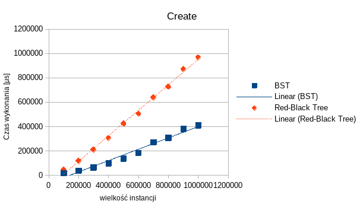
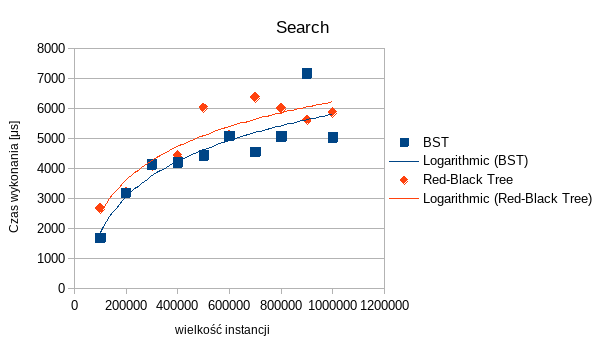
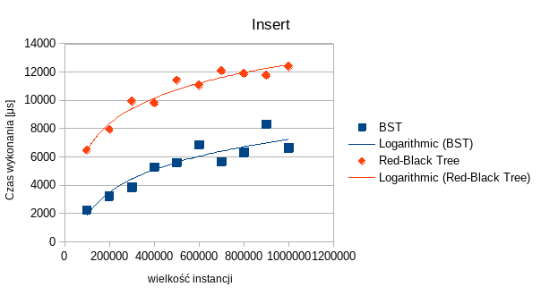
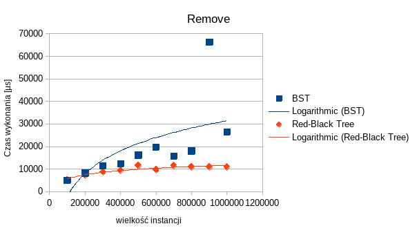

# Zadanie 3

Określenie czasowej złożoności obliczeniowej operacji tworzenia struktury oraz operacji dodawania, usuwania i
wyszukiwania elementów w strukturze.

## Opis testowanych algorytmów

### Drzewo BST

Drzewo BST (_Binary Search Tree_) to drzewo binarne w którym lewe poddrzewo każdego węzła zawiera wyłącznie elementy o
kluczach mniejszych niż klucz węzła a prawe poddrzewo zawiera wyłącznie elementy o kluczach nie mniejszych niż klucz
węzła.

### Drzewo czerwono-czarne

Rodzaj samobalansującego się drzewa BST które w każdym węźle dodatkowo przechowuje informację o kolorze - każdy węzeł
może być czerwony lub czarny. Ta informacja używana jest aby zagwarantować że najdłuższa ścieżka z korzenia do liścia
będzie maksymalnie dwa razy dłuższa od ścieżki najkrótszej.

### Testowane operacje

-   create - tworzenie drzewa o zadanej wielkości
-   search - wyszukanie wartości w drzewie
-   insert - wstawianie nowych elementów do drzewa
-   remove - usunięcie elementów z drzewa

## Procedura badawcza

Wykonane zostały pomiary dla następujących operacji:

-   tworzenie drzewa o zadanym rozmiarze instancji poprzez wykonywanie operacji insert
-   wstawianie nowych elementów do drzewa
-   znajdywanie elementów w drzewie
-   usuwanie elementów z drzewa

Dane wejściowe generowane są przez generator liczb pseudolosowych zainicjalizowany stałym ziarnem, co zapewni
niezmienność danych pomiędzy kolejnymi uruchomieniami programu. Po uruchomieniu programu i przetworzeniu pliku
konfiguracyjnego, program kolejno będzie generował instancje o rozmiarze podanym w pliku. Następnie na tych instancjach
będą wykonywane operacje wstawiania, wyszukiwania oraz usuwania.

## Wyniki i analiza

### Tworzenie

Widoczne jest, że tworzenie drzewa jest operacją `O(n log n)` (wykonujemy `n` wstawień, w każdym `log n` porównań).

### Wyszukiwanie

Widoczna jest złożoność `O(log n)` dla operacji wyszukiwania. Wydajność obu drzew jest zbliżona, ponieważ oba są
zbalansowane.

### Wstawianie

W wypadku wstawiania, oprócz złożoności `O(log n)` widzimy także znacząco wyższy (2x-3x) wyższy czas wykonania dla
drzewa czerwono-czarnego. Powodem jest potrzeba zachowania własności drzewa wymagająca jego rebalansowanie.

### Usuwanie

Jak wszystkie pozostałe operacje, usuwanie również charakteryzuje się złożonością `O(log n)`.
