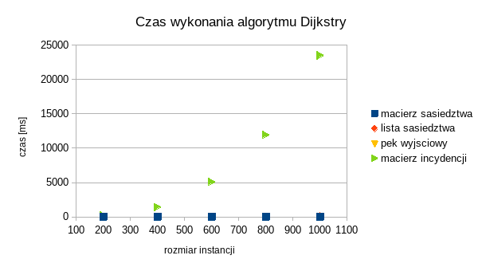
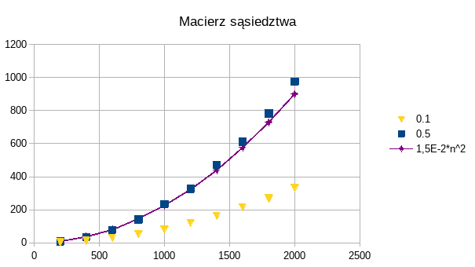
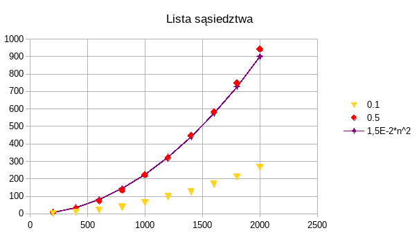

# Zadanie 4

Badanie implementacji struktur grafowych - objętości pamięciowej oraz złożoności obliczeniowej algorytmu Dijkstry.

## Badane implementacje

### Macierz sąsiedztwa

Graf reprezentowany jest w postaci macierzy n x n, gdzie n to liczba wierzchołków. Połączenie z wierzchołka a i b jest
zapisywane jako `macierz_{ab} = waga`.

### Lista sąsiedztwa

Graf reprezentowany jest w postaci listy trójek `(wierzcholek_start, wierzcholek_koniec, waga)`.

### Macierz incydencji

Graf reprezentowany jest w postaci macierzy n x e gdzie n to liczba wierzchołków, a e to liczba krawędzi.

### Pęk wyjściowy

Pęk wyjściowy jest zasadniczo podobny do listy sąsiedztwa, z paru ulepszeniami. Dla uporządkowanych par wierzchołków
(n1, n2), krawędzie łączące wierzchołek n1 z innymi wierzchołkami występują bezpośrednio po sobie w liście wierzchołków,
w nieprzerwanych ciągach. Dodatkowo, dodana została tablica `node_indexes`, w której indeks reprezentuje indeks
wierzchołka, natomiast wartość jest indeksem do listy sąsiedztwa pod którym znajduje się pierwsza krawędź łącząca
wierzchołek n1 z jakimś innym wierzchołkiem.

## Algorytm najkrótszej ścieżki Dijkstry

Algorytm Dijkstry to algorytm wyszukiwania najkrótszej ścieżki. Po podaniu wierzchołka startowego, algorytm zwraca listę
trójek: wierzchołek, przez który inny wierzchołek prowadzi do niego droga, łączna waga ścieżki - dla wszystkich
wierzchołków w grafie. Aby wyznaczyć drogę do konkretnego wierzchołka `n1`, należy znaleźć go w liście, następnie
znaleźć wierzchołek z którego przychodzimy do `n1`, np. `n2`, znaleźć wierzchołek z którego przychodzimy do `n2`, np.
`n3`, etc. aż dojdziemy do wierzchołka startowego.

## Procedura badawcza

Mierzone były czas wykonania oraz zużycie pamięci. Wykonane zostały pomiary dla następujących operacji:

-   znajdywanie najkrótszych ścieżek algorytmem Dijkstry w grafie bez ujemnych wag
-   złożoność pamięci różnych implementacji grafu ze zmiennym rozmiarem instancji oraz stopniem wypełnienia.

Dane wejściowe generowane są przez generator liczb pseudolosowych zainicjalizowany stałym ziarnem, co zapewni
niezmienność danych pomiędzy kolejnymi uruchomieniami programu. Po uruchomieniu programu i przetworzeniu pliku
konfiguracyjnego, program kolejno będzie generował instancje o rozmiarze podanym w pliku. Następnie na tych instancjach
będą wykonywane pomiary wydajności algorytmu Dijkstry oraz pomiar objętości pamięciowej dla różnych stopni wypełnienia.

Program generuje grafy w następujący sposób:

1. Utwórz graf o danej ilości wierzchołków bez krawędzi.
2. Wybieramy wierzchołek `n1`, łączymy go z losowym wierzchołkiem `n2`, `n2` łączymy z losowym wierzchołkiem `n3`, itd.
   aż wszystkie wierzchołki będą połączone i graf będzie spójny.
3. Dla każdego wierzchołka ze zbioru wszystkich możliwych wierzchołków, dołącz go do grafu lub nie z prawdopodobieństwem
   podanym jako argument.

## Wyniki i analiza

### Algorytm Dijkstry

Bardzo zła wydajność macierzy incydencji, będąca rzędy wielkości większa od innych reprezentacji, spowodowała że
testowanie i prezentowanie jej dla rozmiarów instancji > ~1000 jest niepraktyczne. Na potrzeby porównania, czas
wykonania dla macierzy incydencji będzie pokazany dla max n = 1000. Dla większych rozmiarów instancji, macierz
incydencji nie będzie porównywana.

Implementacja algorytmu została wykonana w sposób generyczny, tzn. algorytm używa operacji interfejsu `Graph`, który
implementują wszystkie struktury reprezentacji grafu. Wynikowa złożoność tego algorytmu jest zatem zależna od złożoności
implementacji metod interfejsu `Graph`. Jeżeli złożoności którejś z operacji różnią się pomiędzy implementacjami,
widoczna będzie różnica w czasie wykonania.

Weźmy za przykład funkcję `get_neighbours(node)` zwracającą listę sąsiadów wierzchołka `node`. Dla listy sąsiedztwa oraz
pęku wyjściowego, złożoność tej operacji wynosi `O(d(node))` gdzie `d(node)` oznacza rząd wierzchołka `node`. Dla
macierzy sąsiedztwa jednak, złożoność tej operacji wynosi `O(v)` (gdzie `v` to liczba wierzchołków), ponieważ dla
wierzchołka aby uzyskać jego sąsiadów musimy przeiterować cały wiersz macierzy. Powinna zatem wystąpić różnica.

I w istocie, jeżeli sprawdzimy czas wykonania algorytmu dla stopnia wypełnienia 0.1, widzimy nieco większy czas
wykonania dla macierzy sąsiedztwa. Gdy spojrzymy na wykres dla stopnia wypełnienia 0.5, widzimy że tutaj różnica w
czasach jest mniejsza. Zatem im więcej mamy krawędzi, tym mniej znacząca jest złożoność `O(n)` operacji
`get_neigbours()`.

### Macierz sąsiedztwa

### Lista sąsiedztwa

### Macierz incydencji

### Pęk wyjściowy

Widoczne jest że dla minimalnie spójnego grafu na którym wykonane zostały testy, złożoność algorytmu Dijkstry wynosi
`O(n^2)`.

Różnice w czasie wykonania pomiędzy stopniem wypełnienia 0.1 i 0.5 dowodzą znaczącego wpływu ilości krawędzi na czas
wykonania algorytmu. Istnieje zgodność z referencyjną złożonością algorytmu równą `O(E + V log V)`

### Objętość pamięciowa

Widzimy że zużycie pamięci macierzy sąsiedztwa jest stałe, podczas gdy listy oraz pęku rosną wraz z zapełnianiem grafu.

## Pytania na które warto odpowiedzieć

> Która z reprezentacji jest odporna na zmiany gęstości grafu?

Macierz sąsiedztwa, aby dodać krawędź wystarczy tylko wpisać nową wartość do odpowiednich indeksów macierzy. Nie
zwiększamy tym zużycia pamięci.

> Która jest najtrudniejsza w implementacji ze względu na możliwość popełnienia błędów oraz liczbę możliwych miejsc, w
> których błędy można popełnić?

Najtrudniejszy w implementacji pod tym względem był pęk wyjściowy. Wymaga on ręcznego utrzymywaniu niezmienników i
odpowiedniego operowania tablicą offsetów krawędzi aby przyśpieszyć operacje. Np. dzięki tej tablicy wiemy pod który
indeks listy sąsiedztwa udać się po krawędzie połączone z danym wierzchołkiem, oraz wiemy ile ich jest (wystarczy
zaglądnąć do wartości tablicy offsetowej następnego wierzchołka). Trzeba jednak pamiętać aby po dodaniu nowej krawędzi
dla wierzchołka `N` zaktualizować wartości offsetów dla wierzchołków `n > N`.

> Która z reprezentacji jest najefektywniejsza pamięciowo, pamięciowo-czasowo i czasowo (w badanym zastosowaniu)?

-   gęste grafy - macierz sąsiedztwa
-   rzadkie grafy - lista sąsiedztwa/pęk
