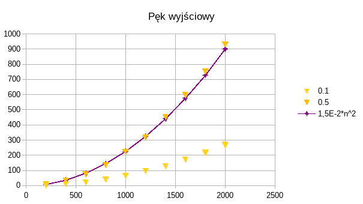

# Zadanie 3

Badanie implementacji struktur grafowych - objętości pamięciowej oraz złożoności obliczeniowej algorytmu Dijkstry.

## Badane implementacje

### Macierz sąsiedztwa

Graf reprezentowany jest w postaci macierzy n x n, gdzie n to liczba wierzchołków. Połączenie z wierzchołka a i b jest
zapisywane jako `macierz_{ab} = waga`.

### Lista sąsiedztwa

Graf reprezentowany jest w postaci listy trójek `(wierzcholek_start, wierzcholek_koniec, waga)`.

### Macierz incydencji

Graf reprezentowany jest w postaci macierzy n x e gdzie n to liczba wierzchołków, a e to liczba krawędzi.

### Pęk wyjściowy

Pęk wyjściowy jest zasadniczo podobny do listy sąsiedztwa, z paru ulepszeniami. Dla uporządkowanych par wierzchołków
(n1, n2), krawędzie łączące wierzchołek n1 z innymi wierzchołkami występują bezpośrednio po sobie w liście wierzchołków,
w nieprzerwanych ciągach. Dodatkowo, dodana została tablica `node_indexes`, w której indeks reprezentuje indeks
wierzchołka, natomiast wartość jest indeksem do listy sąsiedztwa pod którym znajduje się pierwsza krawędź łącząca
wierzchołek n1 z jakimś innym wierzchołkiem.

## Badany algorytm najkrótszej ścieżki Dijkstry

Algorytm Dijkstry to algorytm wyszukiwania najkrótszej ścieżki. Po podaniu wierzchołka startowego, algorytm zwraca listę
trójek: wierzchołek, przez który inny wierzchołek prowadzi do niego droga, łączna waga ścieżki - dla wszystkich
wierzchołków w grafie. Aby wyznaczyć drogę do konkretnego wierzchołka `n1`, należy znaleźć go w liście, następnie
znaleźć wierzchołek z którego przychodzimy do `n1`, np. `n2`, znaleźć wierzchołek z którego przychodzimy do `n2`, np.
`n3`, etc. aż dojdziemy do wierzchołka startowego.

## Procedura badawcza

Mierzone były czas wykonania oraz zużycie pamięci. Wykonane zostały pomiary dla następujących operacji:

-   znajdywanie najkrótszych ścieżek algorytmem Dijkstry w grafie bez ujemnych wag

Dane wejściowe generowane są przez generator liczb pseudolosowych zainicjalizowany stałym ziarnem, co zapewni
niezmienność danych pomiędzy kolejnymi uruchomieniami programu. Po uruchomieniu programu i przetworzeniu pliku
konfiguracyjnego, program kolejno będzie generował instancje o rozmiarze podanym w pliku. Następnie na tych instancjach
będą wykonywane pomiary wydajności algorytmu Dijkstry oraz pomiar objętości pamięciowej dla różnych stopni wypełnienia.

## Wyniki i analiza

### Algorytm Dijkstry

Bardzo zła wydajność macierzy incydencji, będąca rzędy wielkości większa od innych reprezentacji, spowodowała że
testowanie i prezentowanie jej dla rozmiarów instancji > ~1000 jest niepraktyczne. Na potrzeby porównania, czas
wykonania dla macierzy incydencji będzie pokazany dla max n = 1000. Dla większych rozmiarów instancji, macierz
incydencji nie będzie porównywana.

### Macierz sąsiedztwa

### Lista sąsiedztwa

### Macierz incydencji

### Pęk wyjściowy

Widoczne jest że dla minimalnie spójnego grafu na którym wykonane zostały testy, złożoność algorytmu Dijkstry wynosi
`O(n^2)`.

## Pytania na które warto odpowiedzieć

> Która z reprezentacji jest odporna na zmiany gęstości grafu?

Macierz sąsiedztwa, aby dodać krawędź wystarczy tylko wpisać nową wartość do odpowiednich indeksów macierzy. Nie
zwiększamy tym zużycia pamięci.

> Która jest najtrudniejsza w implementacji ze względu na możliwość popełnienia błędów oraz liczbę możliwych miejsc, w
> których błędy można popełnić?

Najtrudniejszy w implementacji pod tym względem był pęk wyjściowy. Wymaga on ręcznego utrzymywaniu niezmienników i
odpowiedniego operowania tablicą offsetów krawędzi aby przyśpieszyć operacje. Np. dzięki tej tablicy wiemy pod który
indeks listy sąsiedztwa udać się po krawędzie połączone z danym wierzchołkiem, oraz wiemy ile ich jest (wystarczy
zaglądnąć do wartości tablicy offsetowej następnego wierzchołka). Trzeba jednak pamiętać aby po dodaniu nowej krawędzi
dla wierzchołka `N` zaktualizować wartości offsetów dla wierzchołków `n > N`.

> Która z reprezentacji jest najefektywniejsza pamięciowo, pamięciowo-czasowo i czasowo (w badanym zastosowaniu)?

-   gęste grafy - macierz sąsiedztwa
-   rzadkie grafy - lista sąsiedztwa/pęk
